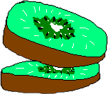

Kiwi - data pack description language
=====================================

[Kiwi](https://buttersus.github.io/Kiwi/home) is a language for describing Minecraft datapack,
built with a focus on syntax, based on
[Kotlin](https://kotlinlang.org/) and some other languages.

## Quick syntax look

Hello_World.kiwi

```kiwi
fun main() <- load(always) {
    print("Hello, World!")  # outputs "Hello, World!" to the chat
}
```

Event_Kill.kiwi

```kiwi
fun killedEvent(player: selector) -> promise<selector> <- tick(1) {
    static kills: scoreboard(playerKillCount)
    if (kills[player] > 0) {
        kills[player] = 0
        return $promise(player)
    }
}

fun main(player: selector) <- killedEvent(@a) {
    when (player.name) {
        "ButterSus" -> print("You goddamn hacker!")
        else -> print("He sucks!")
    }
}
```

see more [examples here](https://buttersus.github.io/Kiwi/examples).

## Features

- **Simple syntax** - Kiwi is designed to be easy to read and write.
Check out the [syntax](https://buttersus.github.io/Kiwi/basics/syntax) page.
- **Intelligent design** - Kiwi is designed especially for Minecraft data packs,
so you can implement your custom support for any ideas with no restrictions.
- **Huge documentation** - Look at Kiwi [documentation](https://buttersus.github.io/Kiwi/get-started),
which is constantly updated.

## Installation

[//]: # (TODO: Add installation instructions)

## Usage

[//]: # (TODO: Add usage instructions)

## Contributing

Currently, Kiwi is in the early stages of development, only one person is working on it.
So, if you want to help with the development of Kiwi, contact me on Discord: `ButterSus#0146`. 

## License

Kiwi is licensed under the [MIT License](LICENSE).

## Any questions?

[//]: # (TODO: Add discord server link)
Join to our [discord server](#)!
